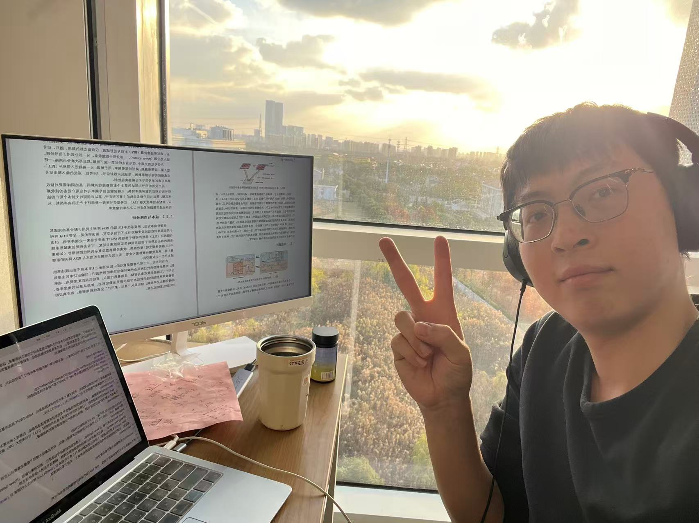

<!DOCTYPE html>
<html lang="en">
<head>
    <meta charset="UTF-8">
    <meta name="viewport" content="width=device-width, initial-scale=1.0">
    <title>Yixuan Guo - Taiyuan University of Technology</title>
    
</head>
<body>
    

        <!-- 左侧栏：照片+基本信息 -->
        

            <!-- 照片：把你的证件照命名为 profile.jpg 上传到仓库根目录即可显示 -->
            
            
            <h1>Yixuan Guo</h1>
            
Associate Professor

            
College of Electronic Information Engineering Taiyuan University of Technology

            
            

                
<strong>Email:</strong> guoyixuan@tyut.edu.cn

                
<strong>Address:</strong> Taiyuan, Shanxi, China

            

        

        <!-- 右侧主内容 -->
        

            <!-- 研究方向 -->
            

                <h2>Research Interests</h2>
                <ul>
                    <li>Wireless Communications and Beamforming</li>
                    <li>Resonant Beam Based Integrated Sensing and Communication (ISAC)</li>
                    <li>Passive Indoor Positioning and Localization</li>
                    <li>Wireless Power Transfer (WPT) and SWIPT</li>
                    <li>MIMO Systems and UAV Networks</li>
                </ul>
            

            <!-- 教育经历 -->
            

                <h2>Education</h2>
                <ul>
                    <li>
                        <strong>Ph.D. in Intelligent Science and Technology</strong> 
                        Tongji University, Sep. 2022 – Jun. 2026 
                        Joint Training: Shanghai Artificial Intelligence Laboratory 
                        Advisors: Prof. Gang Yan, Prof. Qingwen Liu
                    </li>
                    <li>
                        <strong>M.S. in Software Engineering</strong> 
                        Northwest Normal University, Sep. 2019 – Jun. 2022 
                        Advisor: Prof. Xiangdong Jia
                    </li>
                    <li>
                        <strong>B.E. in Software Engineering</strong> 
                        Shanxi University, Sep. 2014 – Jun. 2018 
                        Minor: Accounting (Double Degree)
                    </li>
                </ul>
            

            <!-- 期刊论文 -->
            

                <h2>Selected Journal Publications</h2>
                

                    [1] Y. Guo, et al. Resonant Beam Enabled DoA Estimation in Passive Positioning System.
                    IEEE Transactions on Wireless Communications, 2024.
                    (CAS Zone 1, IF=10.7)
                

                

                    [2] Y. Guo, et al. Resonant Beam Enabled Passive 3D Positioning.
                    IEEE Internet of Things Journal, 2025.
                    (CAS Zone 1, IF=8.9)
                

                

                    [3] Y. Guo, et al. Resonant Beam Multi-Target DOA Estimation.
                    IEEE Internet of Things Journal, 2026.
                    (CAS Zone 1, IF=8.9)
                

                

                    [4] J. Mu#, Y. Guo#, et al. 3D Passive Positioning with Individual Resonant Beam Base Station.
                    IEEE Transactions on Green Communications and Networking, 2026.
                    (Co-first author, CAS Zone 2, IF=6.7)
                

                

                    [5] J. Mu, Y. Guo, et al. A Low LO Frequency Resonant Beam System for Multi-User Self-Aligning SWIPT.
                    IEEE Internet of Things Journal, 2026.
                    (Supervised student as first author, CAS Zone 1)
                

                

                    [6] X. Jia, Y. Guo, et al. Age of Information and Energy Efficiency of AF Relay-Assisted IoT with Non-Linear Energy Harvesting.
                    Transactions on Emerging Telecommunications Technologies, 2022.
                    (CAS Zone 4, IF=2.5)
                

            

            <!-- 会议论文 -->
            

                <h2>Conference Publications</h2>
                

                    [1] Y. Guo, et al. RF-RBComm: Pilotless Beamforming and Uplink-Downlink Frequency Separation Method.
                    IEEE/CIC ICCC Workshops, Shanghai, China, 2025. (EI)
                

                

                    [2] Y. Guo, et al. Outage Performance Evaluation for Drone Assisted Three-Dimensional Heterogeneous Networks.
                    IEEE VTC2021-Fall, Norman, OK, USA, 2021. (EI)
                

                

                    [3] Y. Guo, et al. Analysis of Downlink Coverage and Capacity for 3D Mobile UAV Networks.
                    IEEE ISMII, Zhuhai, China, 2021. (EI)
                

            

            <!-- 专利 -->
            

                <h2>Patents</h2>
                

                    [1] Q. Liu, Y. Wu, Y. Guo. Radio Positioning and Early Warning Method and System for Maneuvering Vehicle Area.
                    CN Patent, Publication No. CN116609723A, 2023.
                

                

                    [2] Q. Liu, S. Han, S. Du, Y. Guo, et al. Integrated System and Method for Power Supply, Positioning and Communication Based on Resonant Beam.
                    CN Patent, Publication No. CN116961253A, 2023.
                

                

                    [3] Q. Liu, S. Du, Z. Zhang, et al. Clustered UAV Ad Hoc Network Communication Architecture.
                    CN Patent, Publication No. CN119052881A, 2024.
                

            

            <!-- 科研项目 -->
            

                <h2>Research Projects</h2>
                <ul>
                    <li>National Key R&D Program of China (2022YFA1004700), 2022–2027. (Student Lead)</li>
                    <li>Tongji University Interdisciplinary Key Project: CPS Fault Diagnosis Platform for UAV Swarms, 2022–2027. (Participant)</li>
                    <li>NSFC General Program: Distributed Laser Mobile Charging Technology (61771344). (Participant)</li>
                    <li>Gansu Provincial Science and Technology Program: Key UAV Technologies (18YF1GA060). (Participant)</li>
                    <li>Postgraduate Innovation Star Project of Gansu Province (2021CXZX-268), 2021. (Principal Investigator)</li>
                </ul>
            

            <!-- 荣誉奖项 -->
            

                <h2>Awards & Honors</h2>
                <ul>
                    <li>First-Class Academic Scholarship, Northwest Normal University, 2021</li>
                    <li>Third Prize, "Challenge Cup" Gansu Provincial College Students' Academic Competition, 2021</li>
                    <li>Outstanding Member, CCF Northwest Normal University Student Chapter, 2021</li>
                </ul>
            

        

    

</body>
</html>
